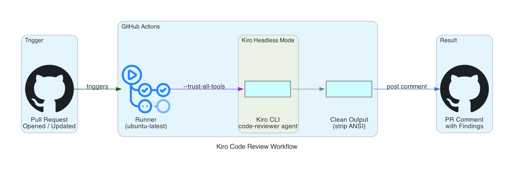
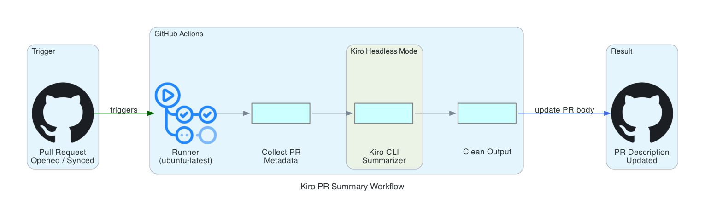
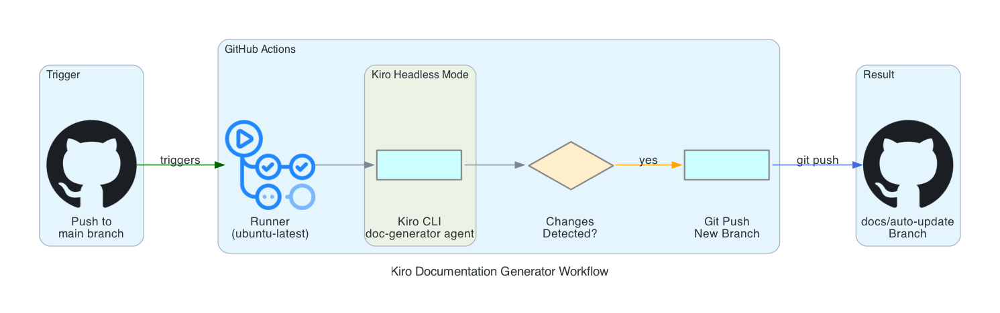
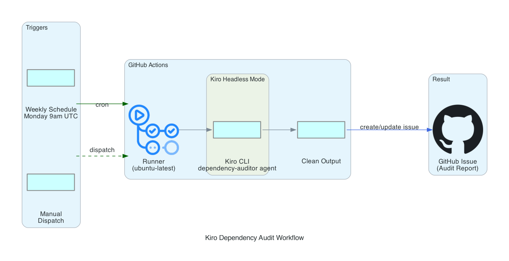

# Kiro Headless Mode — CI/CD Automation Demo

Production-grade GitHub Actions workflows powered by [Kiro CLI Headless Mode](https://kiro.dev/docs/cli/headless/). Four automated workflows that run custom Kiro agents in your CI/CD pipeline — no browser, no interactive terminal.

## Workflows

| Workflow | Trigger | What it does |
|----------|---------|-------------|
| **Code Review** | Pull requests | Reviews changed files for security issues, bugs, and code quality |
| **PR Summary** | Pull requests | Generates a human-readable summary and appends it to the PR description |
| **Doc Generator** | Push to `main` | Scans the codebase and opens a PR with documentation updates |
| **Dependency Audit** | Weekly (Monday 9am UTC) + manual | Audits dependencies for vulnerabilities, outdated packages, and license issues |

## Setup

### 1. Get a Kiro API key

Sign in at [app.kiro.dev](https://app.kiro.dev) and generate an API key from your account settings. Requires Kiro Pro, Pro+, or Power subscription.

### 2. Add the secret to GitHub

Go to your repository **Settings → Secrets and variables → Actions** and add:

| Secret name | Value |
|-------------|-------|
| `KIRO_API_KEY` | Your Kiro API key |

### 3. Push this repo

The workflows activate automatically:
- Open a PR → Code Review + PR Summary run
- Merge to `main` → Doc Generator runs
- Every Monday → Dependency Audit runs (or trigger manually from Actions tab)

## Custom Agents

Each workflow uses a purpose-built agent defined in `.kiro/agents/`:

| Agent | File | Permissions |
|-------|------|-------------|
| `code-reviewer` | `.kiro/agents/code-reviewer.json` | Read-only (no writes) |
| `doc-generator` | `.kiro/agents/doc-generator.json` | Read + write (creates/updates docs) |
| `dependency-auditor` | `.kiro/agents/dependency-auditor.json` | Read + shell (runs audit commands) |

Agents follow least-privilege: each one only has the tools it needs. The code reviewer can't modify files. The doc generator can't run shell commands. Edit the agent JSON files to tune prompts and tool access for your team.

## Architecture

### Code Review Workflow


### PR Summary Workflow


### Documentation Generator Workflow


### Dependency Audit Workflow


## Production Considerations

- **Concurrency control** — PR workflows use `cancel-in-progress` to avoid duplicate runs on rapid pushes
- **Idempotent comments** — Code review updates its existing comment instead of creating new ones on each push
- **Branch protection** — Doc generator pushes to a feature branch and opens a PR, never commits directly to `main`
- **Timeouts** — All workflows have explicit timeout limits (8-15 min) to prevent runaway costs
- **Least privilege** — Agents use `--trust-tools` with specific categories, not `--trust-all-tools`
- **Secret handling** — API key is stored as a GitHub secret, never logged or exposed
- **Log hygiene** — `KIRO_LOG_NO_COLOR=1` keeps CI logs clean and parseable

## Customization

### Tuning the code reviewer

Edit `.kiro/agents/code-reviewer.json` and modify the `prompt` field. For example, add your team's specific patterns:

```
"Focus especially on our custom ORM patterns in src/db/ and ensure all new endpoints have rate limiting middleware."
```

### Adding new agents

Create a new JSON file in `.kiro/agents/` following the same structure, then reference it in a workflow with `--agent your-agent-name`.

### Running locally

```bash
export KIRO_API_KEY="your-key"
kiro-cli chat --agent code-reviewer --trust-tools=read,grep "Review the recent changes"
```

## Demo Files

This repo includes intentionally flawed sample code across three stacks so the Kiro agents have real findings to surface:

### `nodejs-app/` — Express.js API
| Issue category | Examples |
|---------------|----------|
| Security | SQL injection in every route, hardcoded JWT secret, `.env` with AWS keys committed |
| Auth | No input validation, user enumeration, new users default to admin role, bcrypt salt rounds too low |
| Performance | N+1 queries in `/products/stats`, O(n²) sort, no pagination on list endpoints |
| Code quality | Auth middleware exists but is never used, lodash imported for trivial operations, no error handling consistency |

### `terraform/` — AWS Infrastructure
| Issue category | Examples |
|---------------|----------|
| Security | Hardcoded AWS credentials in provider, IAM `*:*` policy, SSH open to `0.0.0.0/0`, IMDSv1 enabled |
| Data safety | RDS publicly accessible, no encryption at rest, no backups, deletion protection off |
| Best practices | Default VPC, gp2 volumes, no state backend, password output not marked sensitive |

### `docker/` — Container Configuration
| Issue category | Examples |
|---------------|----------|
| Security | Running as root, secrets in build args/ENV, privileged container, debug port exposed |
| Reliability | No health checks, no resource limits, no restart policy, `latest` tags |
| Build quality | No multi-stage build, no `.dockerignore`, `npm install` instead of `npm ci` |

## Links

- [Kiro Headless Mode docs](https://kiro.dev/docs/cli/headless/)
- [Kiro CLI commands reference](https://kiro.dev/docs/cli/reference/cli-commands/)
- [Introducing Headless Mode (blog)](https://kiro.dev/blog/introducing-headless-mode/)
